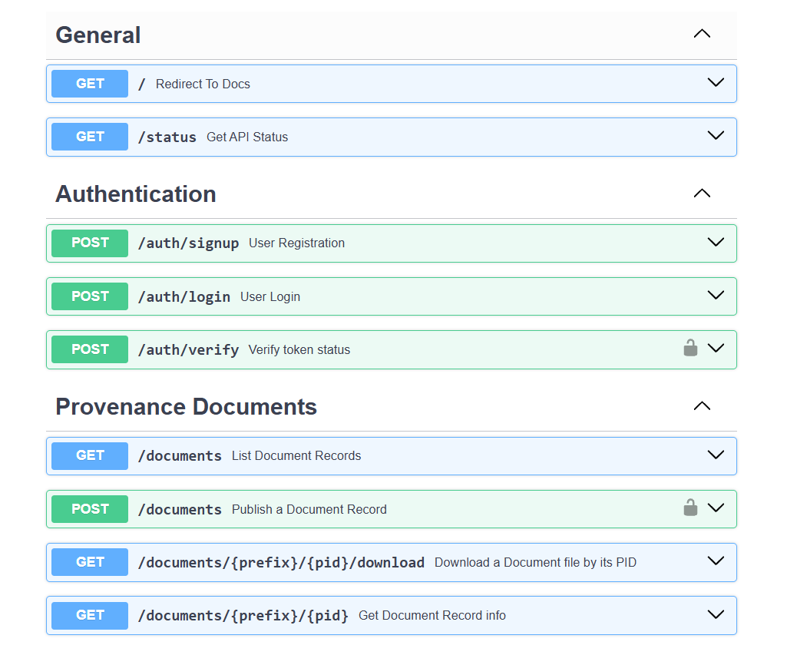
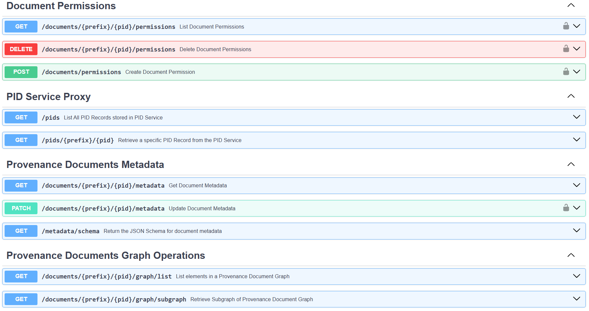

# yProvStore

**yProv** is a provenance service aimed at addressing multi-level provenance as well as reproducibility challenges in climate analytics experiments. It allows scientists to manage provenance information compliant with the [W3C PROV standard](https://www.w3.org/TR/prov-overview/) in a more structured way and navigate and explore the provenance space across multiple dimensions, thus enabling the possibility to get coarse or fine-grained information according to the level of interest.

yProv is a joint project between [University of Trento](https://www.unitn.it) and [CMCC](https://www.cmcc.it).

**yProvStore** is the backend service of yProv, built with FastAPI and designed to handle the storage and retrieval of provenance data. It provides a RESTful API for interacting with provenance information, allowing users to create and read provenance records, manage document metadata, and handle permissions.

## Table of Contents

- [yProvStore](#yprovstore)
  - [Table of Contents](#table-of-contents)
  - [Local Development](#local-development)
    - [TL;DR: Quick Setup & Installation](#tldr-quick-setup--installation)
    - [Python version](#python-version)
    - [Installing Dependencies](#installing-dependencies)
    - [Database Setup](#database-setup)
    - [Environment Variables (Optional)](#environment-variables-optional)
    - [Running the Application](#running-the-application)
    - [Available Endpoints](#available-endpoints)
    - [Troubleshooting](#troubleshooting)
      - [1. Empty database error](#1-empty-database-error)
      - [2. Missing PID private key error](#2-missing-pid-private-key-error)
      - [3. MinIO bucket error](#3-minio-bucket-error)
  - [Application Deployment with Docker](#application-deployment-with-docker)
  - [yProv-CLI](#yprov-cli)
    - [Installation](#installation)
    - [Basic Command Structure](#basic-command-structure)
    - [Available Commands](#available-commands)
    - [Configuration](#configuration)
    - [Authentication](#authentication)
    - [Managing Documents](#managing-documents)
    - [Managing Document Permissions](#managing-document-permissions)
    - [Managing Document Metadata](#managing-document-metadata)
    - [Graph Operations on Documents](#graph-operations-on-documents)
    - [Blockchain Operations](#blockchain-operations)
    - [Managing PIDs](#managing-pids)
    - [Troubleshooting CLI](#troubleshooting-cli)

## Local Development

This section provides instructions for setting up the yProvStore project for local development. It covers the prerequisites, dependencies installation, database setup, and how to run the application.

For a quick setup, you can follow the [TL;DR: Quick Setup & Installation](#tldr-quick-setup--installation) section below, otherwise, you can read through the detailed steps provided in the following sections.

### TL;DR: Quick Setup & Installation

1. **Clone the repository:**
    ```bash
    git clone https://github.com/HPCI-Lab/yProvStore
    cd yProvStore
    ```

2. **Install `uv` (optional, recommended):**
    ```bash
    pip install uv
    ```

3. **Install Python 3.12** (if not already installed).
    You can use `pyenv` or `uv` to manage Python versions:
    ```bash
    uv install python 3.12
    ```

4. **Install dependencies:**
    ```bash
    uv sync
    ```

5. **Run database migrations:**
    ```bash
    uv run alembic upgrade head
    ```

5. **Create a `.env` file** in the root directory to set necessary environment variables. For local testing, you can use:
    ```env
    USE_LOCAL_PID_SERVICE=True  # Uses a mocked version of the PID service for local testing
    USE_LOCAL_FILE_STORAGE_SERVICE=True  # Uses local file storage instead of MinIO for local testing
    ```

    Or, if you want to connect to the real PID service, provide the path to your private key:
    ```env
    PID_PRIVATE_KEY_PATH=keys/user_private.pem
    USE_LOCAL_PID_SERVICE=False
    USE_LOCAL_FILE_STORAGE_SERVICE=True  # Still using local file storage for testing
    ```

    > If you want to use MinIO for file storage, set the following variables instead of `USE_LOCAL_FILE_STORAGE_SERVICE=True`:
    > ```env
    > MINIO_ROOT_USER=minioadmin
    > MINIO_ROOT_PASSWORD=minioadmin
    > MINIO_BUCKET_NAME=yprov-documents
    > MINIO_ENDPOINT=localhost:9000  # Change to your MinIO server (for example within docker it whould be `yprovstore-minio:9000`, which is also the default value)
    > MINIO_SECURE=False  # !! IMPORTANT: if testing locally you need to disable HTTPS
    > ```

6. **Start the application:**
    ```bash
    uv run src/run.py
    ```

    > **NOTE**: If you see errors, check the [Troubleshooting](#troubleshooting) and [Environment Variables](#environment-variables-optional) sections for common issues.

7. **Access the API docs:**  
    Open [http://localhost:8000/docs](http://localhost:8000/docs) in your browser.

    > For CLI usage, run `source prepare_cli.sh` (Linux/macOS) or `call prepare_cli.bat` (Windows) before using `yprov` commands. More details can be found in the [yProv-CLI](#yprov-cli) section below.

---

### Python version

Before starting with dependencies installation, make sure you have `Python 3.12` installed on your system, as it is a requirement to run the application. You can check your Python version by running:

```bash
python --version
```

If you don't have Python 3.12, you can install it using your system's package manager or download it from the [official Python website](https://www.python.org/downloads/release/python-3128/).

Alternatively, you can also use tools such as `pyenv` or `uv` to manage multiple Python versions on your system:
```bash
uv install python 3.12
```
> **NOTE**: `uv` is a tool that simplifies Python project management, including virtual environments and dependency management. It is designed to be faster and more efficient than traditional tools like `pip` and `virtualenv`.
> 
> If not already installed, you can install `uv` using:
> ```bash
> pip install uv
> ```

### Installing Dependencies

After cloning the repository, you can create a virtualenv and install the required dependencies by simply running:

```bash
uv sync
```

This command will set up the environment and install all required packages as specified in the `pyproject.toml` file.

> **NOTE**: All commands run with `uv` will automatically activate the virtual environment, so you don't need to manually activate it. This is one of the advantages of using `uv` for managing your Python projects.

### Database Setup

The application uses `Alembic` to manage database migrations. To set up the database, run the following command in the root directory of the cloned repository:

```bash
uv run alembic upgrade head
```

This command will apply all pending migrations to your database, ensuring that it is up-to-date with the latest schema changes.

### Environment Variables (Optional)

If you need to change any environment variables, you can create a `.env` file in the root directory of the project. This file can contain any environment-specific configurations, such as database connection strings or API keys. Some usefule environment variables are:

```env
LOG_LEVEL=INFO  # Change to DEBUG for more verbose logging
PID_PRIVATE_KEY_PATH=/path/to/private/key.pem  # Path to the private key for PID service (will throw an error if not set and USE_LOCAL_PID_SERVICE is False)
USE_LOCAL_PID_SERVICE=True  # Set to True to use the local PID service for testing purposes (default is False)
USE_LOCAL_FILE_STORAGE_SERVICE=True  # Set to True to use local file storage instead of MinIO (default is False)
```

The other environment variables can be seen in the `src/application/settings.py` file, where they are defined with default values. You can override these defaults by setting them in your `.env` file.


### Running the Application

To run the application, go to the root directory of the cloned repository and use the following command:

```bash
uv run src/run.py
```

Thanks to `uv`, this command will automatically activate the virtual environment and run the FastAPI application.

You can now go to your web browser and navigate to `http://localhost:8000/docs` to access the interactive API documentation provided by FastAPI. This interface allows you to test the API endpoints and explore the available functionality.

### Available Endpoints




### Troubleshooting

#### 1. Empty database error

If you encounter this error when running the application:

```
Exception: Database is empty (no tables), verify your configuration and migrations.
```

It means that the database has not been initialized yet. To resolve this, ensure you have run the Alembic migrations as described in the [Database Setup](#database-setup) section above.

-----

#### 2. Missing PID private key error

If you encounter this error when running the application:

```
FileNotFoundError: PID private key file not found: keys/admpriv.pem. Please provide it or set USE_LOCAL_PID_SERVICE to True if you only need to test locally.
```

It means that the application is trying to use the PID service, but the private key file is missing. To resolve this, you have two options:

1. Provide the missing private key file at the specified path (`keys/admpriv.pem`) - or set the key path `PID_PRIVATE_KEY_PATH` in your `.env` file.
2. Set the `USE_LOCAL_PID_SERVICE` environment variable to `True` in your `.env` file if you only need to test locally.

More details on this can be found in the [Environment Variables](#environment-variables-optional) section above.

-----

#### 3. MinIO bucket error

```
Uploading document from JSON file: examples/prov_valid.json
Error 503:
{'description': 'Failed to ensure storage bucket.'}
❌ Error : No response.
```

If you encounter this error when trying to upload a document, it means that the bucket was not created on MinIO. To resolve this, you need to manually create the bucket defined in the `MINIO_BUCKET` environment variable. You can do this by accessing the MinIO web interface at `http://localhost:9001` and logging in with the root user and password you defined in the `.env` file (default is `minioadmin` with password `minioadmin`). Once logged in, create a new bucket with the name specified in `MINIO_BUCKET` (default name is `yprov-documents`).

Alternatively, you may be missing `MINIO_SECURE=False` in your `.env` file if you are using an insecure connection (HTTP instead of HTTPS which is the case of local testing).

## Application Deployment with Docker

The application can also be deployed using Docker and Docker Compose. This allows you to run the application in a containerized environment, making it easier to manage dependencies and configurations.

The `docker-compose.yml` file in the root directory of the project defines the services required to run the application, which include:
- `api`: The main FastAPI application.
- `minio`: The MinIO server for file storage.
- `postgres`: The PostgreSQL database for storing data useful for managing users and documents.
- `pgbouncer`: A lightweight connection pooler for PostgreSQL. This helps to manage database connections efficiently, especially under high load.
- `pgbouncer-init`: An initialization service that sets up the necessary pgbouncer configuration before starting the pgbouncer service.

To deploy the application using Docker, follow these steps:

1. Make sure you have Docker and Docker Compose installed on your machine.
2. Create a `.env` file in the root directory of the project and define the necessary environment variables.
   
    ```
    JWT_SECRET_KEY=your_secret_key  # Change this to a secure random value
    PID_PRIVATE_KEY_PATH=/path/to/private/key.pem  # Path to the private key for PID service (will throw an error if not set and USE_LOCAL_PID_SERVICE is False)
    MINIO_ROOT_USER=<your_minio_root_user>
    MINIO_ROOT_PASSWORD=<your_minio_root_password>
    MINIO_BUCKET=<your_minio_bucket>  # default: yprov-documents
    MINIO_SECURE=False  # !! IMPORTANT: if testing locally you need to disable HTTPS
    
    POSTGRES_USER=<your_db_user>  # Set your desired Postgres user
    POSTGRES_PASSWORD=<your_db_password>  # Set your desired Postgres password
    POSTGRES_DB=yprovstore
    ```

    > Additional environment variables can be set as needed. See the file `src/application/settings.py` for more details.

3. Run the following command to start the application:

    ```bash
    docker-compose up --build  # Add -d to run in detached mode
    ```

4. The application will automatically create the documents bucket on the first storage request if it does not already exist. If instead you want to manually create the MinIO bucket defined in the `MINIO_BUCKET` environment variable, you can do this by accessing the MinIO web interface at `http://localhost:9001` and logging in with the root user and password you defined in the `.env` file. Once logged in, create a new bucket with the name specified in `MINIO_BUCKET`.
5. Now you can access the API documentation at `http://localhost:8000/docs` and the documents will be uploaded to the MinIO bucket.


## yProv-CLI

This command-line interface (CLI) allows you to interact with the yProv API directly from your terminal.

### Installation

To install the CLI and its dependencies, navigate to the repository root directory and run the following commands.

#### Linux and macOS

```bash
chmod +x prepare_cli.sh
source prepare_cli.sh
```

#### Windows
```bash
call prepare_cli.bat
```

This will set up the CLI environment by initiating the virtual environment and making the `yprov` command available in your terminal.

> **Note**: After you have finished using the CLI, you can deactivate the virtual environment by running `deactivate` in your terminal.

**Prepare the CLI before its usage:**

In general, remember to always run `source prepare_cli.sh` (or `call prepare_cli.bat` on Windows) before using the CLI to ensure that the environment is set up correctly.
This should be done not only when you first install the CLI, but also whenever you open a new terminal session where you want to use the CLI.


### Basic Command Structure

The basic structure of the CLI commands is as follows:

```bash
yprov <command> [options]
```

Where `<command>` is the specific action you want to perform, such as `auth`, `documents`, etc., and `[options]` are additional parameters for that command.

### Available Commands

```bash
yprov check
yprov auth signup
yprov auth login
yprov auth verify
yprov auth logout
yprov documents create --json-file <path/to/document.json> [--parent-pid <parent_pid>] [--compressed] [--trustworthy]
yprov documents list [--page <page_number>] [--page-size <page_size>] [--updated-after <timestamp>] [--created-after <timestamp>]
yprov documents get <document_pid>
yprov documents download <document_pid> [--output-folder <path>] [--output <file_path>] [--compressed] [--debug]
yprov documents permissions add <document_pid> --user-email <email> --permission-level <level>
yprov documents permissions list <document_pid>
yprov documents permissions delete <document_pid> --user-email <email>
yprov documents metadata get <document_pid>
yprov documents metadata update <document_pid> --key1 <key1> --key2 <value2>
yprov documents metadata schema
yprov documents graph list <document_pid> [--entity-types <type>] [--entity-ids <id>] [--is-element] [--is-relation] [--in-json] [--display-data] [--output <file_path>]
yprov documents graph subgraph <document_pid> --entity-id <entity_id> [--direction <direction>] [--output <file_path>]
yprov blockchain create --pid <pid> --url <url> --hash <hash> --owners <owners> [--timestamp <timestamp>] [--file <file_path>]
yprov blockchain read <pid>
yprov blockchain list --start-time <start_time> --end-time <end_time> [--format <table|json>]
yprov blockchain test
yprov pids list [--page <page_number>] [--page-size <page_size>]
yprov pids get <pid>
```

Each of these commands is better explained below.

However, you can also examine the help message for each command by running:

```bash
yprov <command> --help
```

-----

### Configuration

The CLI defaults to connecting to `http://127.0.0.1:8000`. You can specify a different API server URL in two ways:

1.  **Using the `--api-url` option:**

    ```bash
    yprov --api-url http://your-api-server.com:8000 check
    ```

2.  **Setting an environment variable:**

    ```bash
    export YPROV_API_URL="http://your-api-server.com:8000"
    ```
    > Or on Windows:
    > ```cmd
    > set YPROV_API_URL="http://your-api-server.com:8000"
    > ```

    You can then check the status of the API server with:

    ```bash
    yprov check
    ```

-----

### Authentication

First, you need to register and log in to get an access token. The token is stored locally and used for all authenticated requests.

  * **Sign up** for a new account.
    ```bash
    yprov auth signup
    ```
  * **Log in** to your account to get an access token.
    ```bash
    yprov auth login
    ```
  * **Verify** that your token is valid and see which user you are logged in as.
    ```bash
    yprov auth verify
    ```
  * **Log out** by deleting your local access token.
    ```bash
    yprov auth logout
    ```

-----


### Managing Documents

Once authenticated, you can create, list, and download provenance documents.

  * **Create a new document** from a JSON file or a JSON string (only one of these options is allowed at a time).

    ```bash
    # From a file:
    yprov documents create --json-file examples/doc.json

    # Or from an inline JSON string:
    yprov documents create --value "{\"title\":\"My Doc\",\"owner_email\":\"me@example.com\"}"
    ```

    You can also specify a parent document in either case:

    ```bash
    yprov documents create \
      --json-file examples/doc.json \
      --parent-pid <parent_pid_here>
    ```

    For enhanced trustworthiness, you can create a blockchain record alongside the document:

    ```bash
    # Create document with blockchain record for trustworthiness
    yprov documents create \
      --json-file examples/doc.json \
      --trustworthy

    # Or with both parent PID and blockchain record
    yprov documents create \
      --json-file examples/doc.json \
      --parent-pid <parent_pid_here> \
      --trustworthy
    ```

    For faster uploads of large documents, you can enable compression:

    ```bash
    # Upload with zstd compression to reduce transfer time
    yprov documents create \
      --json-file examples/doc.json \
      --compressed
    ```

    **Options:**

    - `--json-file`: Path to a JSON file containing the document data
    - `--value`: A JSON string containing the document data (mutually exclusive with `--json-file`)
    - `--parent-pid`: PID of the parent document, if any
    - `--compressed`: Compress the document data using zstd before uploading to reduce transfer size (requires `zstandard` library)
    - `--trustworthy`: Also create a record of the document on the blockchain for enhanced trustworthiness and immutable provenance tracking

    **Notes:** 
    - To use the `--trustworthy` option, you need to configure the blockchain connection environment variables as described in the [Blockchain Operations](#blockchain-operations) section. If the blockchain configuration is missing or invalid, the document record creation will fail with an appropriate error message.

  * **List all available documents** (with pagination).

    ```bash
    yprov documents list [--page <page_number>] [--page-size <page_size>] [--updated-after <timestamp>] [--created-after <timestamp>]
    ```

    - `--page <page_number>`: Page number to retrieve (zero-indexed, default: 0).
    - `--page-size <page_size>`: Number of documents per page (default: 10).
    - `--updated-after <timestamp>`: Only return documents updated after this timestamp (ISO 8601 format, e.g., `2024-06-01T00:00:00Z` or `2024-06-01`).
    - `--created-after <timestamp>`: Only return documents created after this timestamp (ISO 8601 format, e.g., `2024-06-01T00:00:00Z` or `2024-06-01`).

    Examples:

    * List the first page (default 10 items):

      ```bash
      yprov documents list
      ```

    * List the third page (page 2, zero-indexed) with 50 items per page:

      ```bash
      yprov documents list --page 2 --page-size 50
      ```

    * List documents updated after June 1, 2024:

      ```bash
      yprov documents list --updated-after 2024-06-01
      ```

    * List documents updated after a specific timestamp:

      ```bash
      yprov documents list --updated-after 2024-06-01T00:00:00Z
      ```

    * List documents created after June 1, 2024:

      ```bash
      yprov documents list --created-after 2024-06-01
      ```

    * List documents created after a specific timestamp:

      ```bash
      yprov documents list --created-after 2024-06-01T00:00:00Z
      ```

  * **Get detailed information** for a specific document by its PID.

    ```bash
    yprov documents get <your_document_pid>
    ```

  * **Download a document's file**.

    ```bash
    Usage: yprov documents download [OPTIONS] PID

    Download a document file by its PID.

    Options:
      -o, --output FILE                 Full path to save the file (e.g.,
                                        'my_dir/my_doc.json'). This overrides --output-folder.
      --output-folder DIRECTORY         Folder to save the file in. The filename will
                                        default to the document's PID.
      --compressed                      Request compressed download from server to reduce
                                        transfer size (requires zstd).
      --debug                           Enable debug output for troubleshooting compression issues.
      --trustworthy / --no-trustworthy  Verify SHA256: recompute the local file hash and
                                        compare it with the hash stored in the yProvStore database
                                        and the one on the blockchain. Defaults to --no-trustworthy.
    ```

    Notes:
    - `--output` takes precedence over `--output-folder`.
    - If `PID` uses the `prefix/pid` form, the CLI will create a `prefix/` subfolder (inside the chosen output folder or the current directory) and save the file as `prefix/pid.json`.
    - The `--compressed` option requests the server to send compressed data (zstd format), which is automatically decompressed before saving. This can significantly reduce download time for large documents.
    - The `--debug` option provides detailed information about the download process, including compression status and data inspection.
    - When `--trustworthy` is passed the command will:
       1. recompute the downloaded file's SHA-256,
       2. fetch the DB hash from `GET /documents/{pid}`,
       3. read the blockchain-stored hash via the Fabric connector (! this requires proper blockchain configuration, see the [Blockchain Operations](#blockchain-operations) section),
       4. print a summary and indicate whether the three hashes match.

    Examples:

    * Save to the current directory (e.g., `<pid>.json`):

      ```bash
      yprov documents download <your_document_pid>
      ```

    * Save to a specific folder:

      ```bash
      yprov documents download <your_document_pid> --output-folder /path/to/downloads
      ```

    * Save with a specific file name and path:

      ```bash
      yprov documents download <your_document_pid> --output /path/to/my_doc.json
      ```

    * Download with compression for faster transfer:

      ```bash
      yprov documents download <your_document_pid> --compressed
      ```

    * Download with compression and debug information:

      ```bash
      yprov documents download <your_document_pid> --compressed --debug
      ```

    * Download and verify hash against DB and blockchain:

      ```bash
      yprov documents download <your_document_pid> --trustworthy
      ```

    * Combine compression with hash verification:

      ```bash
      yprov documents download <your_document_pid> --compressed --trustworthy
      ```

    * Force skip verification (explicit) (is the default behavior):

      ```bash
      yprov documents download <your_document_pid> --no-trustworthy
      ```


  * **List all available documents**.

    ```bash
    yprov documents list
    ```

  * **Get detailed information** for a specific document by its PID.

    ```bash
    yprov documents get <your_document_pid>
    ```

  * **Download a document's file**.

      ```bash
      Usage: yprov documents download [OPTIONS] PID
      
      Download a document file by its PID.
      
      Options:
        -o, --output FILE          Full path to save the file (e.g.,
                                  'my_dir/my_doc.json'). This overrides --output-
                                  folder.
        --output-folder DIRECTORY  Folder to save the file in. The filename will
                                  default to the document's PID.
      ```
      
      * Save to the current directory (e.g., `<pid>.json`):
      
        ```bash
        yprov documents download <your_document_pid>
        ```
      * Save to a specific folder:
        ```bash
        yprov documents download <your_document_pid> --output-folder /path/to/downloads
        ```
      * Save with a specific file name and path:
        ```bash
        yprov documents download <your_document_pid> --output /path/to/my_doc.json
        ```

-----

### Managing Document Permissions

You can grant or view permissions on documents. Internally, all permissions live on the *first version* of a document—adding or listing against any version will target that root document.

* **Add a permission**

  ```bash
  yprov documents permissions add <prefix/id> \
    --user-email user@example.com \
    --permission-level write
  ```

  Notes:

  * PID **must** be in `prefix/id` form.
  * Permissions are always stored on the first version; granting on v2 or v3 still writes to v1.
  * The first version document must already reside on this server instance.
  * Although `read` is supported by the service, setting `read` on already‑public docs may result in an error.

- **List permissions**

  ```bash
  yprov documents permissions list <pid>
  ```

  `<pid>` must be `prefix/id`. This shows every user and their permission level on that document’s first version.

- **Delete a permission**

  ```bash
  yprov documents permissions delete <prefix/id> --user-email user@example.com
  ```

  This command deletes the permission for the specified user on the document's first version. The `<prefix/id>` can be provided in the same way as in the list command.

  You must be the owner of the first version of the document to delete permissions. If you are not the owner, you will receive a `403 Forbidden` error.

-----

### Managing Document Metadata


You can manage metadata for documents, including retrieving and updating it.

- **Get metadata for a document**

  ```bash
  yprov documents metadata get <document_pid>
  ```

  This command retrieves the metadata associated with the specified document PID.

- **Update metadata for a document**

  ```bash
  yprov documents metadata update <document_pid> --key <value>
  ```

  This command updates the metadata for the specified document PID.
  You can specify multiple key-value pairs to update multiple metadata fields at once.
  To set a list field, use multiple invocations of the same option, or pass a list as a comma-separated string.
  For example:

  ```bash
  yprov documents metadata update <document_pid> --title "New Title" --keywords keyword1 --keywords keyword2
  # or
  yprov documents metadata update <document_pid> --title "New Title" --keywords "keyword1,keyword2"
  ```
  
  # This command will empty both title and keywords:
  yprov documents metadata update <document_pid> --title "" --keywords ""
  ```
  
  - The PID must be fully qualified (prefix/id).
  - Only passed fields will be updated; existing fields not specified will remain unchanged.
  - Before updating, the command will validate the provided fields against the metadata schema fetched from the server.
  - Fields not defined in the schema will be ignored.
  - To set an empty field, use an empty string
  - To set a list field, use multiple invocations of the same option.
  - To update a list field, you need to pass the entire list each time.
  - If no fields are provided, the command will exit with a warning.
  - To update metadata for a document, you must be the owner of the document or have write permissions on it.

- **Get metadata schema**

  You can retrieve the metadata schema, which defines the structure and fields of the metadata.

  ```bash
  yprov documents metadata schema
  ```

  The schema defines the structure and fields that can be used in document metadata.

  Example output:

  ```
  > yprov documents metadata schema
                              Document Metadata Schema
  ┌─────────────┬──────────────┬──────────┬────────────────────────────────────────┐
  │ Field       │ Type         │ Required │ Example                                │
  ├─────────────┼──────────────┼──────────┼────────────────────────────────────────┤
  │ title       │ string       │ No       │ Sample Document Title                  │
  │ description │ string       │ No       │ This is a sample document description. │
  │ keywords    │ list[string] │ No       │ ['keyword1', 'keyword2']               │
  └─────────────┴──────────────┴──────────┴────────────────────────────────────────┘
  ```

-----

### Graph Operations on Documents

You can explore and analyze the provenance graph structure of documents. Graph operations allow you to list elements or extract a self-contained subgraph by tracing relationships from specific starting points.

* **List graph elements**

  ```bash
  yprov documents graph list <prefix/id> [OPTIONS]
  ```

  This command lists all elements in a provenance document's graph, including entities, agents, activities, and relationships.

  Options:

  * `--entity-types, -t`   Filter by entity types (can be used multiple times). Examples: `entity`, `agent`, `activity`, `wasDerivedFrom`, `wasGeneratedBy`
  * `--entity-ids, -e`     Filter by specific entity IDs (can be used multiple times)
  * `--is-element, -ie`    Filter by whether the entity is an element (boolean flag)
  * `--is-relation, -ir`   Filter by whether the entity is a relation (boolean flag)
  * `--in-json, -j`        Output results in JSON format with complete data
  * `--display-data, -d`   Include the data field in the console table output
  * `--output, -o`         Save results to a file path (writes complete JSON data)

  Examples:

  * List all graph elements for a document:

    ```bash
    yprov documents graph list myprefix/1234
    ```

  * Filter by specific entity types:

    ```bash
    yprov documents graph list myprefix/1234 --entity-types entity --entity-types agent
    # or, shorter:
    yprov documents graph list myprefix/1234 -t entity -t agent
    ```

  * Filter by entity which are elements:

    ```bash
    yprov documents graph list myprefix/1234 --is-element
    # or, shorter:
    yprov documents graph list myprefix/1234 -ie
    ```

  * Filter by entity which are relations:

    ```bash
    yprov documents graph list myprefix/1234 --is-relation
    # or, shorter:
    yprov documents graph list myprefix/1234 -ir
    ```

  * Filter by entity IDs and display data in the console:

    ```bash
    yprov documents graph list myprefix/1234 --entity-ids "my_entity_1" --display-data
    ```

  * Save results to a JSON file:

    ```bash
    yprov documents graph list myprefix/1234 --output /path/to/graph_elements.json
    ```

  * Get JSON output in the console:

    ```bash
    yprov documents graph list myprefix/1234 --in-json
    ```

  Notes:

  * The PID **must** be in `prefix/id` format.
  * The command displays a table with columns: ID, Type, Group, Is Element, Is Relation.
  * Use `--display-data` to see the actual data content of each element in the console.
  * Multiple filters can be combined (e.g., both entity types and entity IDs).
  * The output includes any warnings from the server and a total count of elements found.


-----

  * **Extract a subgraph**

    ```bash
    yprov documents graph subgraph <prefix/id> [OPTIONS]
    ```

    This command extracts a self-contained subgraph by tracing the provenance relationships from one or more starting entity IDs. The result is a valid **PROV-JSON** document.

    **Options:**

      * `--entity-id, -e` **[Required]** An entity ID to start the traversal from (can be used multiple times).
      * `--direction, -d` The direction for traversal: `forward`, `backward`, or `both` (default: `both`).
      * `--output, -o` Save the resulting PROV-JSON subgraph to a file.

    **Examples:**

      * Extract a subgraph tracing **forward** from a single entity and save it:

        ```bash
        yprov documents graph subgraph myprefix/1234 --entity-id "my_activity_1" --direction forward --output subgraph.json
        ```

      * Get a **backward** trace from an entity, printing the JSON to the console:

        ```bash
        yprov documents graph subgraph myprefix/1234 -e "final_product" -d backward
        ```

      * Trace in **both** directions from multiple starting points:

        ```bash
        yprov documents graph subgraph myprefix/1234 -e "entity_A" -e "entity_B"
        ```

    **Notes:**

      * You **must** provide at least one `--entity-id`.
      * The output is always a PROV-JSON document, not a table.
      * If the resulting JSON is too large to display in the console, it will be automatically saved to a file named `subgraph_<prefix>_<id>.json`.
      * Any warnings from the server are always displayed.

-----

### Blockchain Operations

The `blockchain` command group provides functionality to interact with blockchain networks for document provenance storage. These commands allow you to create, read, and query documents stored on the blockchain, providing an immutable record of document provenance.

**Prerequisites:**

Before using blockchain operations, ensure you have set the required environment variables for your blockchain network connection:

- `CONNECTOR_PEER_TLSCERT_PATH` - Path to the peer TLS certificate
- `CONNECTOR_USR_PKEY_PATH` - Path to the user private key
- `CONNECTOR_PEER_ENDPOINT` - Blockchain peer endpoint
- `CONNECTOR_USR_CERT_PATH` - Path to the user certificate  
- `CONNECTOR_PEER_MSP_ID` - Membership Service Provider ID
- `CONNECTOR_PEER_HOSTNAME` - Peer hostname (optional, defaults to peer endpoint)

* **Create a document on the blockchain**

  ```bash
  yprov blockchain create --pid <pid> --url <url> --hash <hash> --owners <owners> [--timestamp <timestamp>]
  ```

  Create a new document record on the blockchain with the specified provenance information.

  **Options:**

  * `--pid` - Unique identifier for the document (required)
  * `--url` - URL where the document can be accessed (required)
  * `--hash` - Hash of the document content (required)
  * `--owners` - Comma-separated list of document owners (required)
  * `--timestamp` - Document timestamp in ISO-8601 format (optional, defaults to current time)
  * `--file` - Path to a JSON file containing document data (alternative to individual options)

  **Examples:**

  * Create a document with command-line options:

    ```bash
    yprov blockchain create \
      --pid "prefix/example-doc" \
      --url "https://example.com/documents/example-doc.json" \
      --hash "sha256:abc123def456" \
      --owners "user1@example.com,user2@example.com"
    ```

  * Create a document from a JSON file:

    ```bash
    yprov blockchain create --file document_data.json
    ```

    The JSON file should contain:

    ```json
    {
      "pid": "prefix/example-doc",
      "url": "https://example.com/documents/example-doc.json",
      "hash": "sha256:abc123def456",
      "owners": ["user1@example.com", "user2@example.com"],
      "timestamp": "2024-01-01T12:00:00Z"
    }
    ```

  **Notes:**

  * Cannot use both `--file` and individual options simultaneously
  * Owners list is automatically normalized (duplicates removed)
  * If timestamp is not provided, current time will be used

* **Read a document from the blockchain**

  ```bash
  yprov blockchain read <pid>
  ```

  Retrieve and display a document's information from the blockchain by its PID.

  **Examples:**

  * Read a document:

    ```bash
    yprov blockchain read "prefix/example-doc"
    ```

  * The command displays document information in a formatted table and offers an option to view the raw JSON data.

* **List documents by time interval**

  ```bash
  yprov blockchain list --start-time <start_time> --end-time <end_time> [--format <format>]
  ```

  Query and list documents created within a specific time interval.

  **Options:**

  * `--start-time` - Start time for the query (ISO-8601 format or timestamp) (required)
  * `--end-time` - End time for the query (ISO-8601 format or timestamp) (required)
  * `--format` - Output format: `table` (default) or `json`

  **Examples:**

  * List documents in a date range with table format:

    ```bash
    yprov blockchain list \
      --start-time "2024-01-01T00:00:00Z" \
      --end-time "2024-01-31T23:59:59Z"
    ```

  * List documents with JSON output:

    ```bash
    yprov blockchain list \
      --start-time "1640995200000" \
      --end-time "1672531200000" \
      --format json
    ```

  **Notes:**

  * Time can be provided in ISO-8601 format or as Unix timestamps
  * Table format truncates long values for readability
  * JSON format provides complete document data

* **Test blockchain connection**

  ```bash
  yprov blockchain test
  ```

  Test the connection to the blockchain network by creating, reading, and querying test documents.

  **Examples:**

  ```bash
  yprov blockchain test
  ```

  **Notes:**

  * This command will create actual test documents on the blockchain
  * Tests document creation, reading, and interval querying functionality
  * Displays current environment variable values for debugging
  * Use this command to verify your blockchain configuration before production use

**Error Handling:**

All blockchain commands provide detailed error messages and will display the current status of required environment variables when connection issues occur. If you encounter authentication or connection errors, verify that all required environment variables are properly set and that your certificates and keys are valid.

-----

### Managing PIDs

`yProvStore` additionally provides some proxy methods to retrieve PID records directly from the underlying PID service (Handle System).

The `pids` group lets you list and retrieve PID records from your PID service.

* **List PIDs** (with optional pagination)

  ```bash
    yprov pids list [OPTIONS]
  ```

  Options:

  * `--page INTEGER`       Page number (zero‑indexed). Default: `0`
  * `--page-size INTEGER`   Number of items per page. Default: `10`

  Examples:

  * List the first page (10 items):

    ```bash
    yprov pids list
    ```
  * List page 2 (zero‑indexed, i.e. the third page) with 50 items per page:

    ```bash
    yprov pids list --page 2 --page-size 50
    ```

- **Get a PID record** (by prefix/id)

  ```bash
  yprov pids get <PID>
  ```

  Examples:

  * Retrieve a record with an explicit prefix:

    ```bash
    yprov pids get myprefix/1234
    ```


### Troubleshooting CLI

If you encounter this issue when running the CLI:

```
command not found: yprov
```

It means that the `yprov` command is not recognized in your terminal. This can happen if the virtual environment is not activated or if the CLI was not set up correctly.
To resolve this, ensure you have run `source prepare_cli.sh` script as described in the [Installation](#installation) section.

